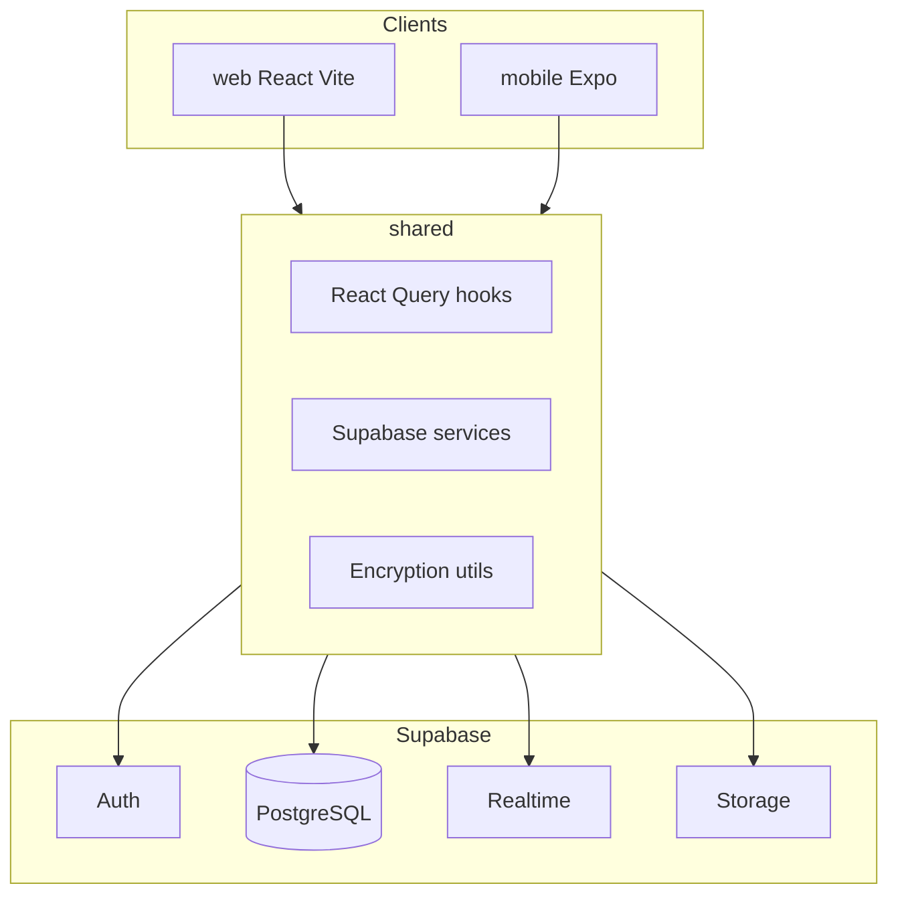

# 4space

4space is a collaborative workspace platform. Users sign in, create or join spaces, and work inside each space through modular widgets. The same backend powers a web app and a mobile app. Shared business logic lives in a TypeScript package used by both clients.

## What this project is

The product centers on **spaces**. A space is a container for people and tools. Each space can be personal, for couples, teams, portfolios, communities, or a custom type. Privacy can be private, shared, team, public, or unlisted.

Inside a space you open **widgets**: chat, files, notes, docs, tasks, calendar, board, forms, links, polls, whiteboard, and wiki. The web app exposes each widget on its own route under `/spaces/:id/...`.

Outside spaces, users have a **dashboard**, a **spaces list**, and a **messages** area for direct and group conversations that are not tied to a single space room.

## Repository layout

```
4space-super/
├── web/                 React web client (Vite)
├── mobile/              React Native app (Expo Router)
├── shared/              @4space/shared services, hooks, types, utils
└── supabase/            Postgres schema, RLS, migrations, local config
```

| Package | Role |
|---------|------|
| `web` | Browser UI, routing, space widgets, space chat, DM inbox |
| `mobile` | iOS and Android (and Expo web) with tabs for home, inbox, spaces, settings |
| `shared` | Supabase services, React Query hook factories, encryption helpers |
| `supabase` | Database migrations, storage buckets, Row Level Security |

## Tech stack

**Web**

* React 19, TypeScript, Vite 7
* React Router 7, TanStack Query 5, Zustand 5
* Tailwind CSS 3, Framer Motion
* Supabase JS client (auth, database, realtime, storage)

**Mobile**

* Expo SDK 54, Expo Router 6, React Native 0.81
* Same data layer as web via `@4space/shared`
* Secure session storage (Expo SecureStore on native, AsyncStorage on web)

**Backend**

* Supabase: PostgreSQL, Auth, Realtime, Storage
* Migrations under `supabase/migrations/` (74 SQL files)
* Local Supabase project id: `4space-super` (see `supabase/config.toml`)

**Shared library**

* `@4space/shared`: spaces, messages, conversations, settings, realtime, WebRTC helpers
* End to end message encryption helpers using TweetNaCl (`EncryptionService`)

## Core concepts

**Profiles**  
Linked to `auth.users`. Username, display name, avatar, bio, last seen.

**Spaces**  
Name, description, type, privacy, icon, color, owner, member count.

**Space members**  
Roles: owner, admin, editor, commenter, viewer. Permissions are defined in `shared/src/types/permissions.ts`.

**Rooms (space chat)**  
Channels inside a space. Support categories, privacy, archives, nested rooms, metadata.

**Conversations (inbox)**  
Direct and group chats separate from space rooms. Participants, read state, last message time.

**Messages**  
Text and media types, replies, threads, forwards, edits, soft delete, pins, TTL and expiry, attachments JSON, reactions, read receipts.

## Features

### Authentication and accounts

* Email signup and login (Supabase Auth, PKCE on web)
* Profile creation and sync with auth user
* Protected routes on web; auth guard on mobile root layout
* Session persistence and token refresh

### Spaces

* Create, update, delete spaces
* Space types: personal, couple, team, portfolio, community, custom
* Privacy levels: private, shared, team, public, unlisted
* Member list and roles
* Invitations (pending, accepted, rejected, expired)
* Space stats (messages, members; more counts planned in service)
* Widget library on the space home screen to enable or open tools
* Convert space privacy modal
* Invite and manage members modals

### Space chat (web, primary implementation)

* Room list and room creation
* Realtime messages via Supabase
* Send, edit, delete messages
* Replies and message grouping
* Emoji reactions (quick reactions and picker)
* Pin messages with duration (1h, 4h, 24h, 7d, or custom keep)
* Bookmark and kept message panels
* Pinned banner and search in room
* Typing indicators and read receipts (configurable)
* Media attachments uploaded to `chat-media` storage bucket
* Per room and per user chat settings (themes, density, timestamps, moderation toggles)
* Message retention policies and expiry
* Left sidebar tabs: rooms, metrics, productivity, reminders, notes
* Right sidebar: settings, metadata, metrics, media, links, customization
* Voice and video calls via WebRTC (`useWebRTC`, call sessions and call history tables)
* Screen share session tracking
* In call chat and reactions tables

### Direct and group messages (web `/messages`)

* Conversation list
* Create direct and group conversations
* User search for new chats
* Same message UX patterns as space chat (pins, reactions, settings sync)
* Realtime conversation updates

### Space widgets (web routes)

Each widget has a dedicated UI under `/spaces/:id/<widget>`.

| Widget | Route | Backend wiring |
|--------|-------|----------------|
| Chat | `/chat` | Live (rooms, messages, calls) |
| Notes | `/notes` | Live (`notes`, `note_checklists` tables) |
| Files | `/files` | UI present; storage and `media_files` exist, full CRUD varies |
| Docs | `/docs` | UI with local sample data |
| Tasks | `/tasks` | UI with local sample data |
| Calendar | `/calendar` | UI |
| Board | `/board` | UI (kanban style) |
| Forms | `/forms` | UI |
| Links | `/links` | UI |
| Polls | `/polls` | UI |
| Whiteboard | `/whiteboard` | UI |
| Wiki | `/wiki` | UI |

### User level content (database)

* `user_notes`, `user_reminders`
* `user_saved_messages`, `user_kept_messages`
* User preferences and display settings (migrations for chat and app preferences)

### Notifications

* `notifications` table with types: space invitation, member joined or left, new message, mention, system

### Mobile app

**Tabs**

* Home (dashboard)
* Inbox (messages)
* Spaces (list, space detail, channels, workspace screens)
* Settings (large settings tree)

**Spaces on mobile**

* Space detail, members, invite, settings, files, analytics
* Workspace screens: notes, docs, board, calendar, forms, links, polls, whiteboard, wiki
* Channel chat screen per room

**Settings areas**

* Profile, appearance (theme, font, bubbles, wallpaper, alignment)
* Messaging (formatting, auto delete)
* Notifications (sound, preview, quiet hours, priority)
* Privacy (last seen, online status, blocked users, session timeout, excluded contacts)
* Storage (cache, backup mode, media quality, download rules)
* Devices and sign out
* Spaces defaults (type, privacy)
* Advanced (language, reset preferences)

See `mobile/README.md` for mobile specific setup and file layout.

### Security and privacy

* Row Level Security on Postgres tables
* Role based permissions per space member
* Client side encryption utilities for space keys and message payloads (TweetNaCl secretbox)
* Storage policies on `chat-media` bucket (authenticated upload, public read for URLs)

## Database overview

Main public tables include:

* `profiles`, `spaces`, `space_members`, `space_invitations`
* `conversations`, `conversation_participants`
* `rooms`, `room_members`
* `messages`, `message_reactions`, `message_read_receipts`, `message_threads`, `typing_indicators`
* `notifications`, `media_files`, `calls`
* `notes`, `note_checklists` (space scoped)
* Call system: `call_sessions`, `call_history`, `screen_share_sessions`, `call_messages`, `call_reactions`
* User content: `user_notes`, `user_reminders`, `user_saved_messages`, `user_kept_messages`

Enums include `space_type`, `space_privacy`, `member_role`, `message_type`, `invitation_status`, `notification_type`.

Apply schema with the Supabase CLI from the repo root:

```bash
supabase start
supabase db reset
```

Link a remote project when deploying:

```bash
supabase link
supabase db push
```

## Environment variables

**Web** (`web/.env`)

```
VITE_SUPABASE_URL=
VITE_SUPABASE_ANON_KEY=
```

**Mobile** (`mobile/.env` or app config)

```
EXPO_PUBLIC_SUPABASE_URL=
EXPO_PUBLIC_SUPABASE_ANON_KEY=
```

The web client throws at startup if Supabase variables are missing.

## Getting started

### Prerequisites

* Node.js 18 or newer
* npm
* Supabase CLI for local database
* For mobile: Expo Go or a dev build, Xcode or Android Studio as needed

### Install dependencies

From the repository root, install each package:

```bash
cd shared && npm install
cd ../web && npm install
cd ../mobile && npm install
```

`web` and `mobile` depend on `@4space/shared` via `file:../shared`.

### Run Supabase locally

```bash
cd supabase
supabase start
```

Note API URL and anon key from the CLI output. Put them in web and mobile env files.

### Run the web app

```bash
cd web
npm run dev
```

Default Vite dev server is typically `http://localhost:5173`.

### Run the mobile app

```bash
cd mobile
npm start
```

Then open on a device or simulator with Expo.

### Other scripts

| Location | Command | Purpose |
|----------|---------|---------|
| `web` | `npm run build` | Production build |
| `web` | `npm run lint` | ESLint |
| `web` | `npm run preview` | Preview production build |
| `mobile` | `npm run ios` | Expo iOS |
| `mobile` | `npm run android` | Expo Android |

## Web routes

**Public**

* `/` landing
* `/login`, `/signup`

**Authenticated**

* `/dashboard`
* `/spaces`, `/spaces/:id`
* `/messages`, `/messages/:chatId`
* `/spaces/:id/chat`
* `/spaces/:id/files`, `notes`, `docs`, `tasks`, `calendar`, `forms`, `links`, `polls`, `board`, `whiteboard`, `wiki`

## Shared package API surface

Exported from `shared/src/index.ts`:

* **Services:** `SpacesService`, `RealtimeService`, messages and conversations services, `SettingsService`
* **Hooks:** space, message, conversation, realtime, settings hook factories (clients pass their Supabase instance into factories in `web/src/hooks/`)
* **Utils:** `EncryptionService`, message retention helpers, date formatting

Web wrappers live in `web/src/hooks/` (for example `useSpaces.ts` wires `createSpaceHooks(supabase)`).

## Architecture diagram



## Implementation notes

* **Production ready paths:** auth, spaces, memberships, invitations, space rooms and messages, inbox conversations, notes widget, call session persistence, chat media storage, chat settings.
* **Rich UI, limited or no backend yet:** several workspace widgets (docs, tasks, calendar, board, forms, links, polls, whiteboard, wiki) ship full interfaces; many use in memory or sample data until dedicated tables and hooks are added.
* **Dashboard and space home activity feeds** may show placeholder or sample activity in places.
* **Space stats** in `SpacesService.getSpaceStats` still has TODO fields for files, tasks, and storage.
